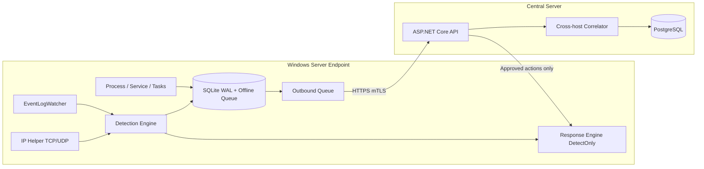

# Cherry Sentinel Agent

Endpoint Security Monitoring Agent for **Windows Server 2012, 2012 R2, 2016, 2019, 2022, and 2025**.

Detects password spray, brute force, lateral movement, and abnormal process/service activity — and attributes **which host, process, and Windows service** connected to **which IP:port**.

Default posture: **detect-only** (no automatic block/kill).

## Architecture



## Stack

| Layer | Technology |
|-------|------------|
| Language | C# / .NET 10 LTS |
| Agent | `net10.0-windows`, `win-x64` self-contained Windows Service |
| Local DB | SQLite (WAL) |
| Central DB | PostgreSQL |
| Transport | HTTPS + optional mTLS, gzip batches, idempotency keys |
| Logging | Serilog rolling files |
| Tests | xUnit |

## Solution layout

```
CherrySentinel.sln
src/   tests/   installer/   docs/   config/   rules/
```

## Desktop Dashboard (native WPF app — not web)

UI inspired by `imggui/` design kit (sidebar + overview cards). Brand icon: `assets/icons/CherrySentinel.ico`.

```powershell
# Run
dotnet run --project src/CherrySentinel.Dashboard/CherrySentinel.Dashboard.csproj -c Release

# Publish + install (elevated)
.\installer\publish-and-install.ps1 -InstallDashboard
# or:
dotnet publish src\CherrySentinel.Dashboard\CherrySentinel.Dashboard.csproj -c Release -r win-x64 -o artifacts\dashboard-win-x64
.\installer\install-dashboard.ps1 -SourceDir .\artifacts\dashboard-win-x64 -StartAfterInstall
```

Installs to `C:\Program Files\Cherry Sentinel\Dashboard` with Desktop + Start Menu shortcuts (icon).

## Build / test

```powershell
cd C:\data_nt\CherrySentinelAgent
dotnet restore
dotnet build CherrySentinel.sln -c Release
dotnet test CherrySentinel.sln -c Release
```


## Publish agent

```powershell
dotnet publish src/CherrySentinel.Agent/CherrySentinel.Agent.csproj `
  -c Release `
  -r win-x64 `
  --self-contained true `
  -p:PublishSingleFile=true `
  -p:IncludeNativeLibrariesForSelfExtract=true `
  -o artifacts/agent-win-x64
```

## Install (elevated)

```powershell
.\installer\install-agent.ps1 `
  -SourceDir .\artifacts\agent-win-x64 `
  -CentralUrl https://sentinel.example.local:7443
```

Service: **CherrySentinelAgent** / Display: **Cherry Sentinel Agent**  
Install dir: `C:\Program Files\Cherry Sentinel Agent`  
Data: `C:\ProgramData\CherrySentinel`

## Central API

| Method | Path |
|--------|------|
| POST | `/api/v1/agents/register` |
| POST | `/api/v1/agents/heartbeat` |
| POST | `/api/v1/events/batch` |
| POST | `/api/v1/connections/batch` |
| POST | `/api/v1/incidents` |
| GET | `/api/v1/incidents` |
| GET | `/api/v1/incidents/{id}` |
| POST | `/api/v1/actions` |
| GET | `/api/v1/actions/{id}` |
| GET | `/api/v1/agents` |
| GET | `/health` |

PostgreSQL migration: `src/CherrySentinel.Server/Migrations/001_init.sql`

## Sample configuration

See `config/appsettings.sample.json` and `config/rules.json`.

## Documentation

- [Architecture](docs/architecture.md)
- [Installation](docs/installation.md)
- [Windows Server 2012](docs/windows-server-2012.md)
- [Compatibility report](docs/compatibility-report-2012.md)
- [Detection rules](docs/detection-rules.md)
- [Incident response](docs/incident-response.md)
- [Threat model](docs/threat-model.md)
- [Known limitations](docs/known-limitations.md)
- [Release notes](RELEASE_NOTES.md)

## License

Proprietary — CherryDeskX / internal use.
