# Cherry Sentinel

 https://www.beezachat.com/api/uploads/media/images/g47jgkglhtabnqmcdpr9tyqzy.png
**Server-first endpoint security** — multi-agent fleet, Central API, native Dashboard.  
Windows Server **2012 → 2025** · Linux agent client · self-contained installers (no separate .NET).

Detects **password spray, brute force, lateral movement**, and abnormal process/service activity — and attributes **which host · process · Windows service** connected to **which IP:port**.

Default posture: **IDS / detect-only** (optional IPS auto-block).

---

## Download installers (GitHub Releases)

**Latest:** [**v1.0.11**](https://github.com/paddman/CherrySentinelAgent/releases/tag/v1.0.11) · [All releases](https://github.com/paddman/CherrySentinelAgent/releases)

| File | Platform | Description | Size |
|------|----------|-------------|------|
| [**CherrySentinel-Setup-1.0.11.exe**](https://github.com/paddman/CherrySentinelAgent/releases/download/v1.0.11/CherrySentinel-Setup-1.0.11.exe) | Windows | Full stack: Central + Agent + Dashboard | ~133 MB |
| [**CherrySentinel-Agent-Setup-1.0.14.exe**](https://github.com/paddman/CherrySentinelAgent/releases/download/v1.0.11/CherrySentinel-Agent-Setup-1.0.14.exe) | Windows | Agent only + tray (Edit Central IP/Port) | ~58 MB |
| [**CherrySentinel-Central-Setup-1.0.4.exe**](https://github.com/paddman/CherrySentinelAgent/releases/download/v1.0.11/CherrySentinel-Central-Setup-1.0.4.exe) | Windows | Central server only | ~13 MB |
| [**CherrySentinel-Linux-Agent-1.0.11-linux-x64.tar.gz**](https://github.com/paddman/CherrySentinelAgent/releases/download/v1.0.11/CherrySentinel-Linux-Agent-1.0.11-linux-x64.tar.gz) | Linux x64 | Agent client + `install-agent.sh` (systemd) | ~31 MB |

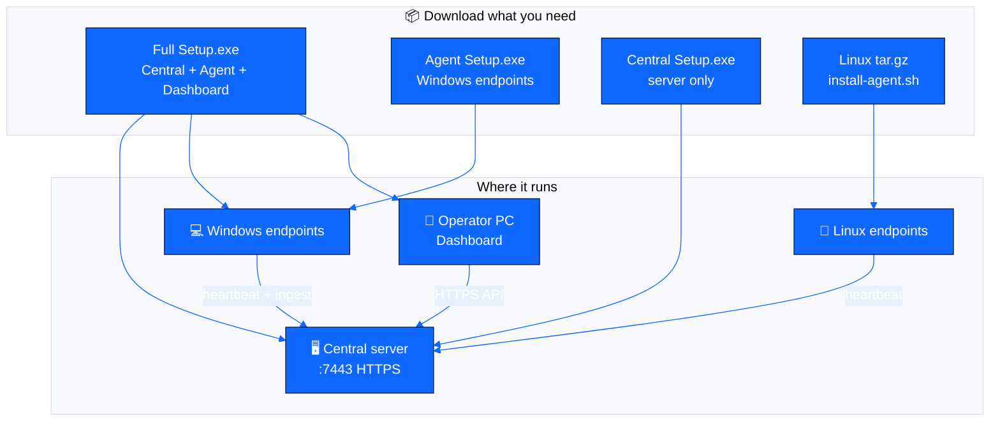

### Quick install

| Scenario | Steps |
|----------|--------|
| **One Windows server (lab/POC)** | Full Setup as Admin → **Full stack** → Dashboard `https://localhost:7443` |
| **Extra Windows PC** | Agent Setup → Central **IP** + port **7443** (not `localhost`) |
| **Linux host** | See bash block below |
| **Silent Windows agent** | `CherrySentinel-Agent-Setup-1.0.14.exe /VERYSILENT /ServerHost=10.0.0.5 /Port=7443` |

```bash
# Linux
tar -xzf CherrySentinel-Linux-Agent-1.0.11-linux-x64.tar.gz
cd CherrySentinel-Linux-Agent-1.0.11-linux-x64
sudo ./install-agent.sh --host <CENTRAL_IP> --port 7443
```

---

## Big picture — system architecture

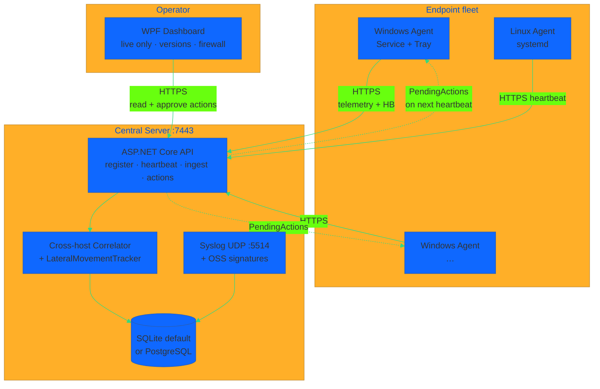

> **Important:** Agent never talks to Dashboard. Both talk to **Central**.  
> Remote agents must use Central **IP:7443**, not `localhost`.

---

## Data flow — collection → detection → central → response

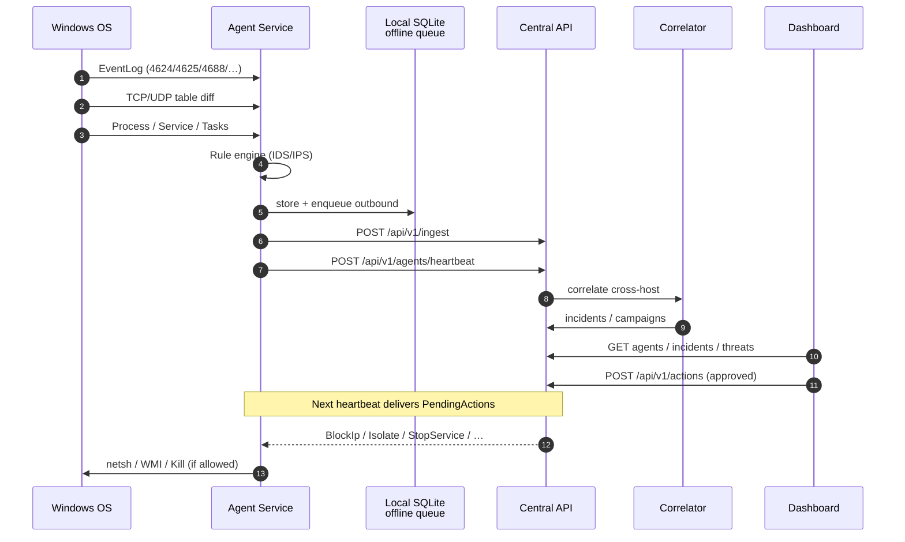

---

## Multi-host lateral path (what makes Cherry distinctive)

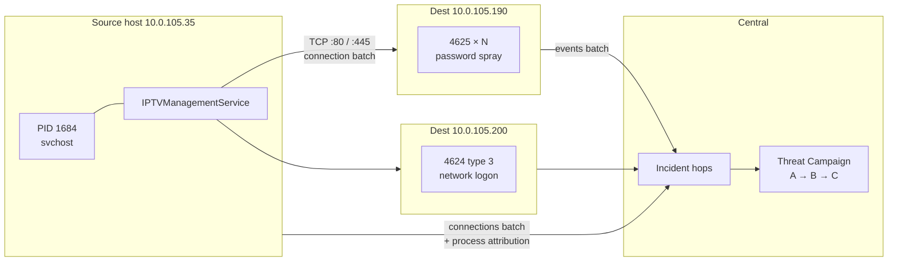

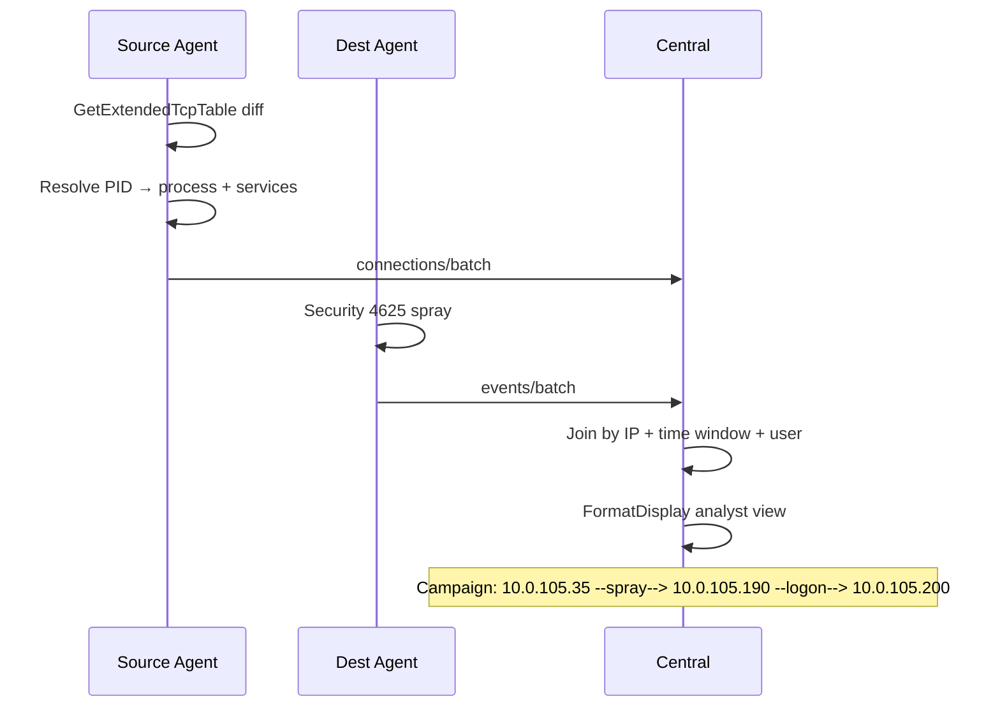

---

## Agent internals (Windows)

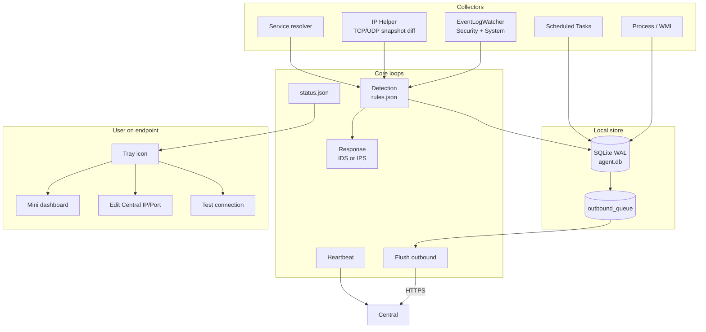

### IDS vs IPS mode

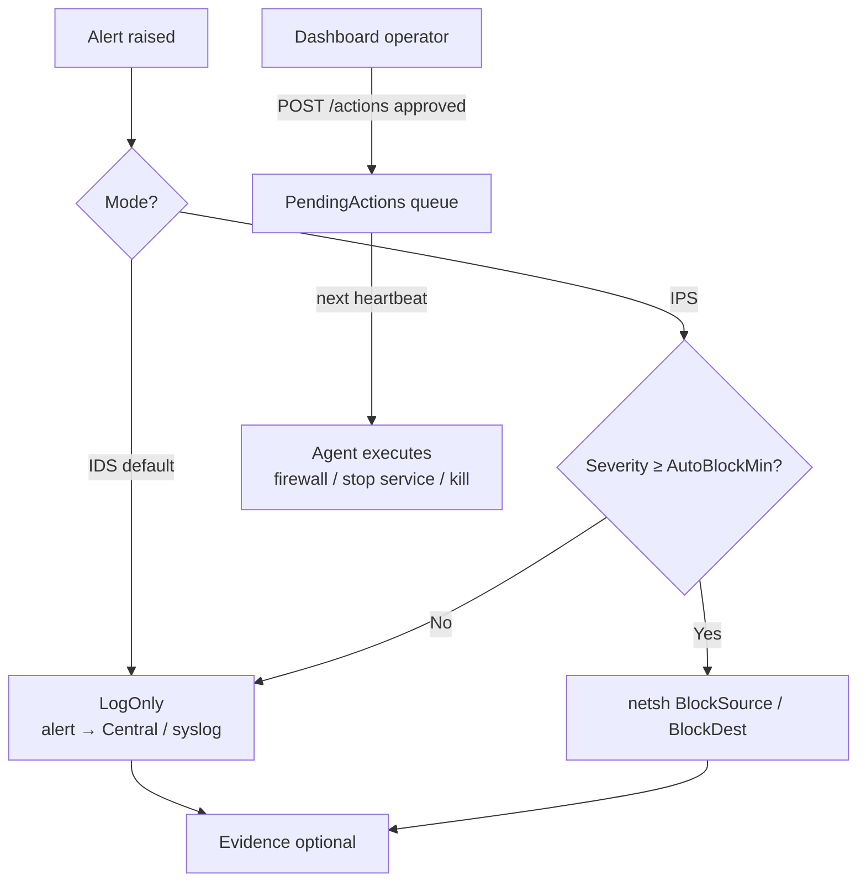

| Mode | Config | Behavior |
|------|--------|----------|
| **IDS** | `Agent:Mode=Ids` / `DetectOnly=true` | Detect + log; no auto contain |
| **IPS** | `Mode=Ips` / sample `config/appsettings.Ips.sample.json` | Auto-block High+ source/dest IP |
| **Operator** | Dashboard Firewall panel | Always via Central → agent heartbeat |

---

## Central internals

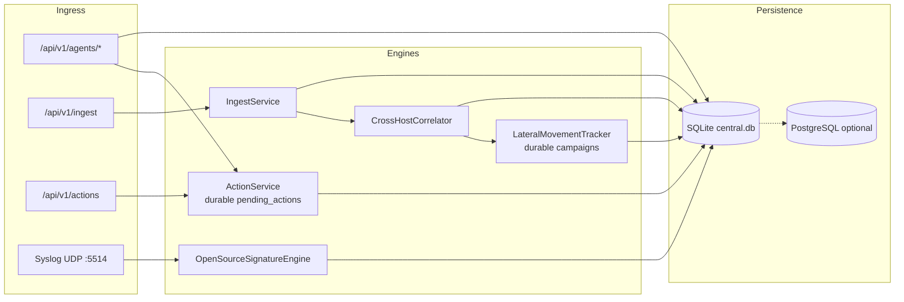

### Health & versions

```bash
curl -k https://localhost:7443/api/v1/health
# { "status":"ok", "product":"Cherry Sentinel Central", "version":"1.0.11", ... }

curl -k https://localhost:7443/api/v1/agents
# online, hostIp, centralUrl, agentVersion, platform, lastError
```

| Surface | Shows version |
|---------|----------------|
| Dashboard sidebar / Settings / title | Dashboard vX · Central vY |
| Agent heartbeat / Endpoints grid | `agentVersion` |
| Tray menu | `Cherry Sentinel Agent vX` |
| `CONNECTION.txt` | Central product version |
| `GET /api/v1/health` | `version` / `productVersion` |

---

## Dashboard map

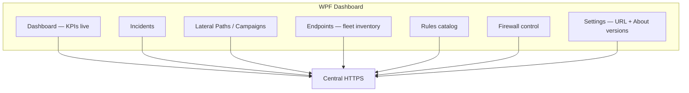

| Page | Data source |
|------|-------------|
| Dashboard | Live incidents / agents only — **no mock data** |
| Endpoints | `/api/v1/agents` (online/offline, OS, Central URL, last error) |
| Lateral Paths | `/api/v1/threats` + hop path |
| Firewall | `POST /api/v1/actions` → agent on next HB |
| Settings | Central URL + **About / Versions** |

---

## Deploy topology examples

### A) Lab — one machine

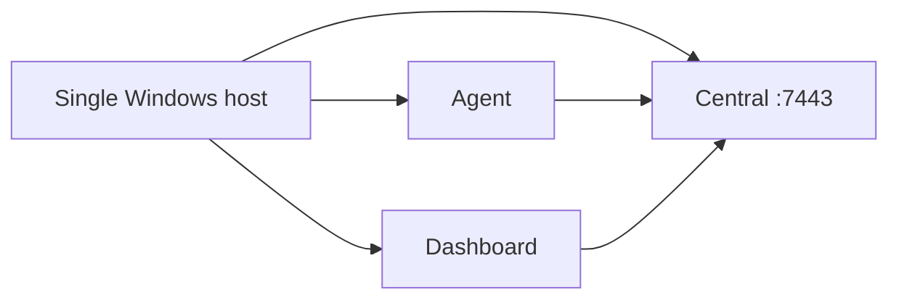

### B) Production-like — server + endpoints

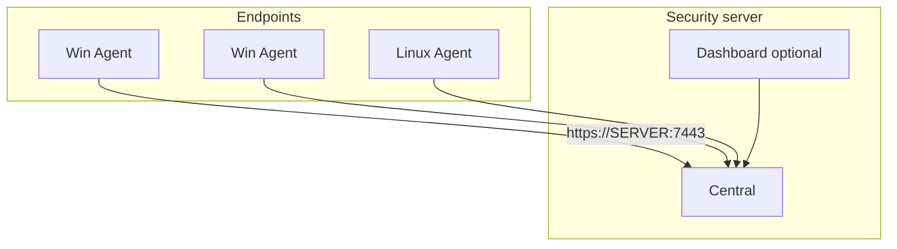

| Wrong | Right |
|-------|--------|
| Agent2 `Server.Url = https://localhost:7443` | `https://<Central-IP>:7443` |
| Dashboard different URL than Agent | **Same** Central base URL |
| Central stopped during install | Start Central first; open firewall TCP 7443 |

---

## Threat coverage (chart + table)

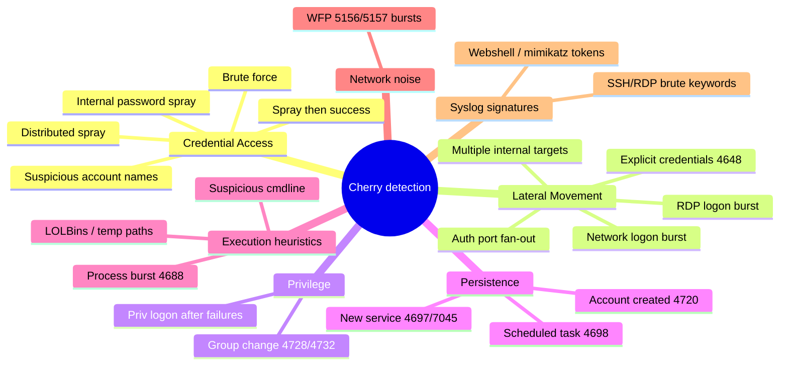

| Category | Example rule IDs | Primary signals |
|----------|------------------|-----------------|
| Credential Access | `INTERNAL_PASSWORD_SPRAY`, `BRUTE_FORCE_SINGLE_ACCOUNT` | 4625 volume / patterns |
| Lateral | `MULTIPLE_INTERNAL_TARGETS`, `RDP_LOGON_BURST` | TCP fan-out + logon types |
| Privilege | `PRIVILEGED_LOGON_AFTER_FAILURES` | 4625→4624 + 4672 |
| Persistence | `NEW_SERVICE_INSTALLED`, `SCHEDULED_TASK_CREATED` | 4697 / 7045 / 4698 |
| Full list | [`config/rules.json`](config/rules.json) · [`docs/threat-coverage.md`](docs/threat-coverage.md) | |

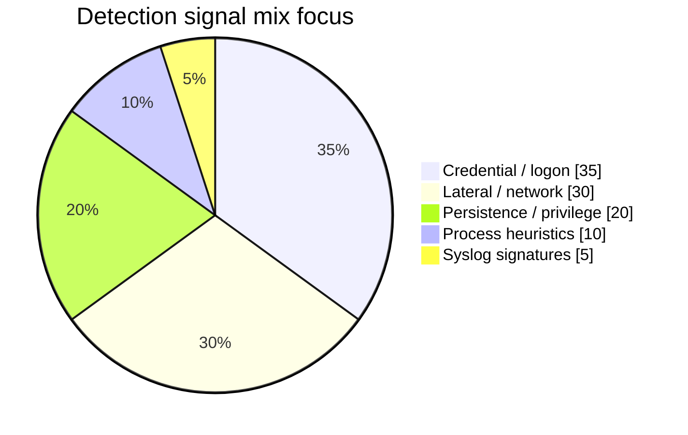

---

## API surface (Central)

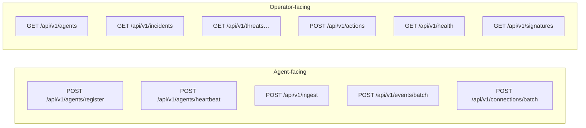

| Method | Path | Purpose |
|--------|------|---------|
| GET | `/api/v1/health` | Health + **version** + syslog info |
| POST | `/api/v1/agents/register` | Enroll agent |
| POST | `/api/v1/agents/heartbeat` | Presence + deliver pending actions |
| GET | `/api/v1/agents` | Fleet inventory |
| POST | `/api/v1/ingest` | Telemetry batch |
| GET/POST | `/api/v1/incidents` | Incidents |
| POST/GET | `/api/v1/actions` | Operator response queue |
| GET | `/api/v1/threats` · `/threats/{id}/path` | Campaigns / hops |
| GET | `/api/v1/signatures` | Loaded OSS signatures |
| UDP | `:5514` | Syslog → signature engine |

---

## Solution map (code)

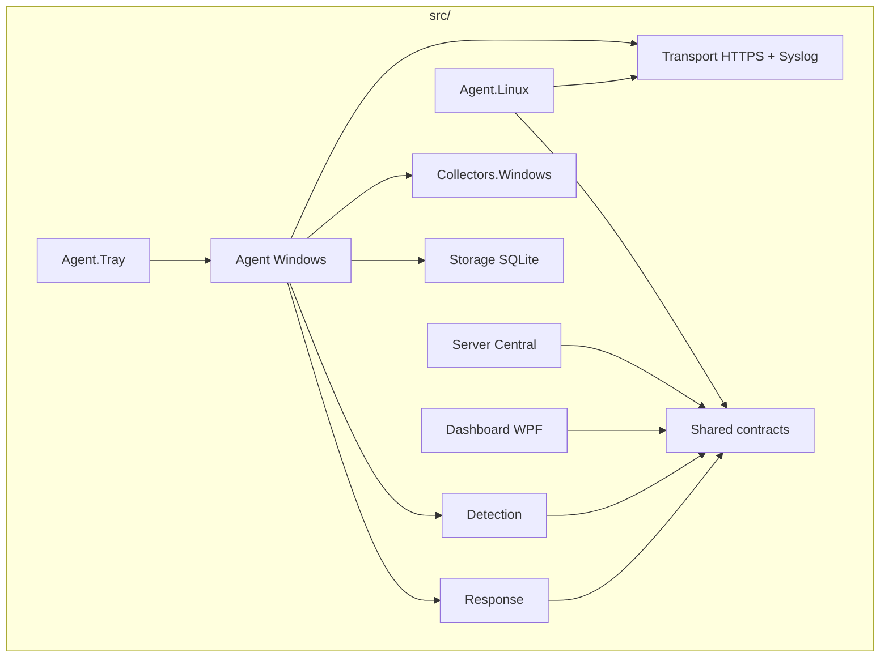

```
CherrySentinel.sln
├── src/
│   ├── CherrySentinel.Agent          # Windows service
│   ├── CherrySentinel.Agent.Tray     # tray + mini UI + IP editor
│   ├── CherrySentinel.Agent.Linux    # Linux client
│   ├── CherrySentinel.Server         # Central API
│   ├── CherrySentinel.Dashboard      # WPF SOC console
│   ├── CherrySentinel.Detection
│   ├── CherrySentinel.Response
│   ├── CherrySentinel.Collectors.Windows
│   ├── CherrySentinel.Storage
│   ├── CherrySentinel.Transport
│   └── CherrySentinel.Shared
├── installer/   # Inno Setup + linux/*.sh
├── config/      # rules.json · signatures · samples
├── docs/
└── tests/
```

---

## Stack

| Layer | Technology |
|-------|------------|
| Language | C# / **.NET 10** |
| Windows Agent | `net10.0-windows`, **win-x64 self-contained** service |
| Linux Agent | `net10.0`, **linux-x64 self-contained**, systemd |
| Local DB | SQLite WAL + offline queue |
| Central DB | **SQLite default** · PostgreSQL optional |
| UI | WPF Dashboard + WinForms tray |
| Transport | HTTPS · optional mTLS · optional syslog UDP |
| Logging | Serilog rolling files |
| Installers | Inno Setup (Windows) · bash + tar.gz (Linux) |

---

## Build from source

```powershell
cd C:\data_nt\CherrySentinelAgent   # or your clone path
dotnet restore
dotnet build CherrySentinel.sln -c Release
dotnet test CherrySentinel.sln -c Release

# Windows packages
.\installer\build-setup.ps1 -Version 1.0.11          # Full
.\installer\build-setup-agent.ps1 -Version 1.0.14    # Agent
.\installer\build-setup-central.ps1                  # Central

# Linux package
.\installer\build-agent-linux.ps1 -Version 1.0.11
# → artifacts\setup\CherrySentinel-Linux-Agent-*-linux-x64.tar.gz
```

### Publish agent only

```powershell
dotnet publish src/CherrySentinel.Agent/CherrySentinel.Agent.csproj `
  -c Release -r win-x64 --self-contained true `
  -p:PublishSingleFile=true `
  -p:IncludeNativeLibrariesForSelfExtract=true `
  -o artifacts/agent-win-x64
```

---

## Install paths (Windows)

| Item | Path |
|------|------|
| Agent service | `CherrySentinelAgent` |
| Central service | `CherrySentinelCentral` |
| Agent install | `C:\Program Files\Cherry Sentinel Agent` or `...\Cherry Sentinel\Agent` |
| Data | `C:\ProgramData\CherrySentinel\` |
| Agent logs | `...\Agent\logs` · `status.json` |
| Central logs | `...\Server\logs` · `central.db` |

**Tray (Windows):** Edit Central IP/Port · Test connection · Mini dashboard · shows **version**.

**Linux:** `/opt/cherrysentinel/agent` · `systemctl status cherrysentinel-agent`

---

## Roadmap (high level)

```mermaid
timeline
  title Cherry Sentinel product roadmap
  section Phase 0
    Durable actions + fleet inventory + versions + Linux client : done
  section Phase 1
    Enrollment token + API auth + policy pull : next
  section Phase 2
    Timeline + process tree + isolate + evidence : next
  section Phase 3
    Light EPP hash/quarantine : planned
  section Phase 4
    Full Linux collectors journald/ss/proc : planned
  section Later
    Scale · reports · XDR connectors : planned
```

Details: [`docs/roadmap-trellix-class.md`](docs/roadmap-trellix-class.md)

---

## Documentation

| Doc | Topic |
|-----|--------|
| [Architecture](docs/architecture.md) | Sequence + modules |
| [Installation](docs/installation.md) | Deploy guide |
| [Detection rules](docs/detection-rules.md) | Rule engine |
| [Threat coverage](docs/threat-coverage.md) | What we detect / track |
| [IDS / IPS mode](docs/ids-ips-mode.md) | Mode switch |
| [Syslog + signatures](docs/syslog-and-signatures.md) | UDP 5514 |
| [Incident response](docs/incident-response.md) | IR workflow |
| [Threat model](docs/threat-model.md) | Security assumptions |
| [Known limitations](docs/known-limitations.md) | Honest limits |
| [Linux agent](installer/linux/README.md) | Linux install |
| [Windows Server 2012](docs/windows-server-2012.md) | Legacy OS notes |

---

## What Cherry does **not** do

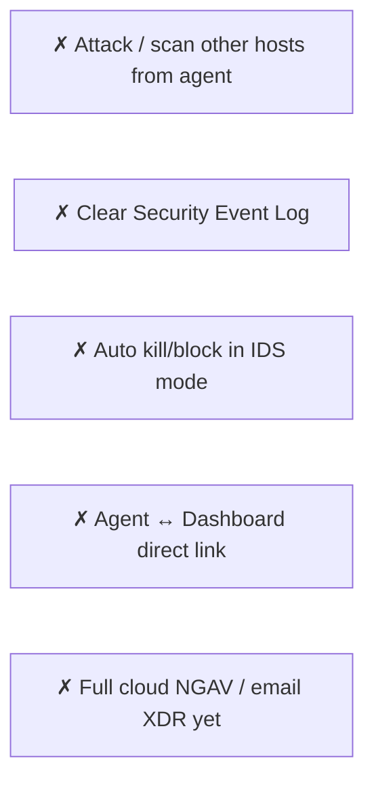

---

## License

Proprietary — CherryDeskX / internal use.

**Repo:** https://github.com/paddman/CherrySentinelAgent  
**Releases:** https://github.com/paddman/CherrySentinelAgent/releases
